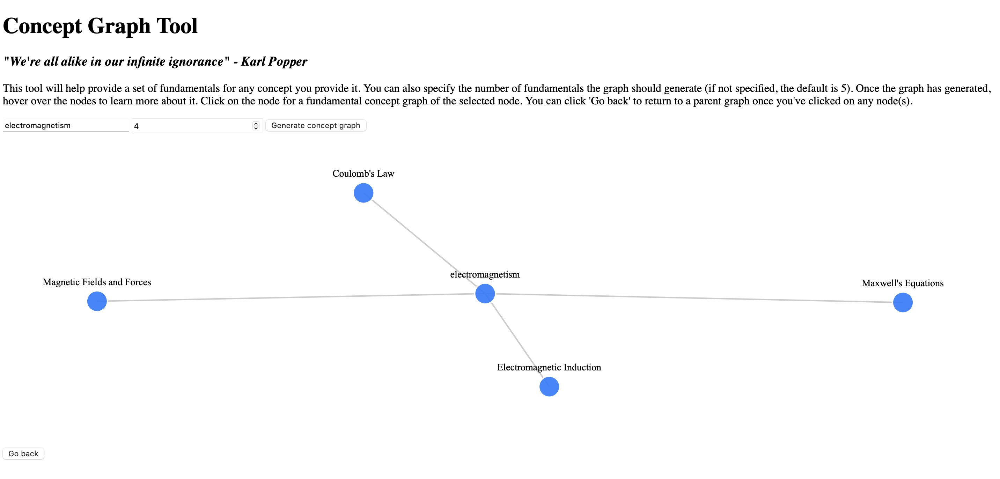
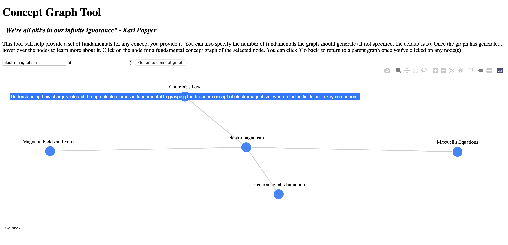
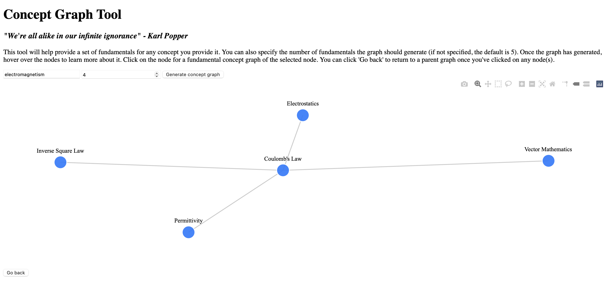

New knowledge builds off of prior knowledge (whether the prior knowledge is accepted as true or not).

This application uses an LLM to generate a set of fundamentals, or prerequisite knowledge, to
understand a  given topic.

Probably  will need to run `pip install -r requirements.txt`,
Add some string to `app.secret_key=` in the app/__init__.py file,
Run the app using `python run.py`,
And access the UI at `http://127.0.0.1:5000/api/index`. 

Future TODOs
* overall aesthetics and responsiveness improvements. sometimes the graph nodes are not super responsive.
* include an overview of the main topic under the concept graph.
* ability to click on a node and have it generate practice problems for you to better understand the concept.
